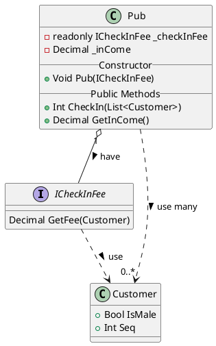

Calculation Fee for enter Pub
===

### 需求說明如下

當顧客進場時，
如果是**女生**，則**免費**入場。
若為**男生**，則根據 **ICheckInFee** 介面來取得門票的費用，
並累計到 **inCome** 中。
透過 **GetInCome**() 方法取得這一次的門票收入總金額   
====  
女生改成**每周4**, 為Ladie's Night, **當日免費入場**; 其餘日子都要收費

[PlantUMLWeb](http://www.plantuml.com/plantuml/uml/LP1FIyGm4CNl-HH3JwtIebUHij95AIXuybgooKY3-GF9H5Z4xsxQJTmsf-Jbz-RbvH28Uuf6CsK9_ISN2ECme_WQxJCY_318Iw9GXcjuGKfYFSH0pg1ls2zZGlCGe4Z5uE99uy8_UUJr1doFfyoqaAwai_gyIvp4_pvZnvm-AJiuSr6d2GPd0_aeoFbqNDLR-71ABXdrPcHJ74dNIi0Rqknak9f6Iv3n-bK5UYnj-YOJn-i7ZEiZBfMMCjLz1QvjTnqUOERV2D2lHDVrKDrrtKq5PN0YOa0mt9uJjBKky9vAm06jZ4R_0G00)

### Tests
- 給定入場人數, 驗證收費人數
    - Arrange
      - 入場客戶為3男2女
    - Act
      - 收費人數 := CheckIn(客戶們)
    - Assert
        - excepted: 3人
- 給定入場人數與收費金額, 驗證收費總額
    - Arrange
        - 入場客戶為3男2女
        - 門票收費為100$
    - Act
        - CheckIn(客戶們)
        - 收費總額 := GetInCome()
    - Assert
        - excepted: 300$

- 給定入場人數, 驗證收費總額,  當日為周五
    - Arrange
        - 入場客戶為3男2女
        - 當日為周五
        - 男生收費100$; 女生收費50$
    - Act
        - CheckIn(客戶們)
        - 收費總額 := GetInCome()
    - Assert
        - excepted: 400$
- 給定入場人數, 驗證收費總額,  當日為周四
    - Arrange
        - 入場客戶為3男2女
        - 當日為周四
        - 男生收費100$; 女生收費0$
    - Act
        - CheckIn(客戶們)
        - 收費總額 := GetInCome()
    - Assert
        - excepted: 300$
    
